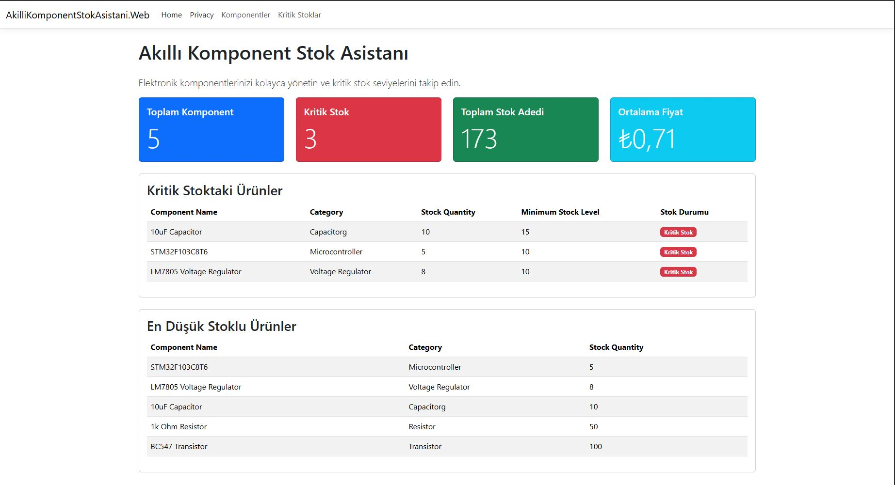
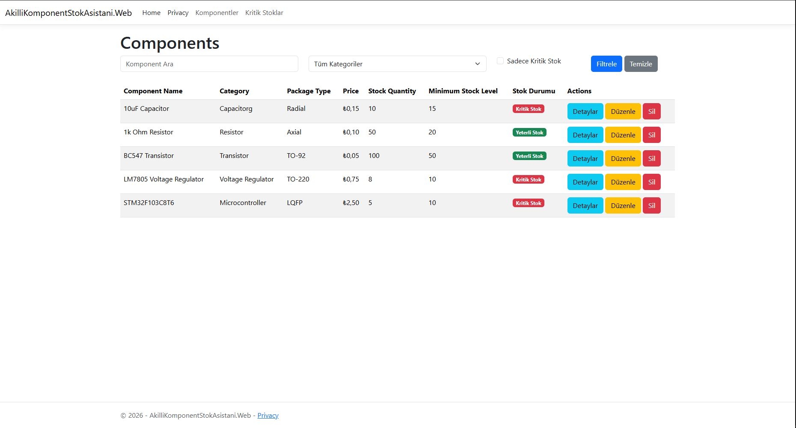
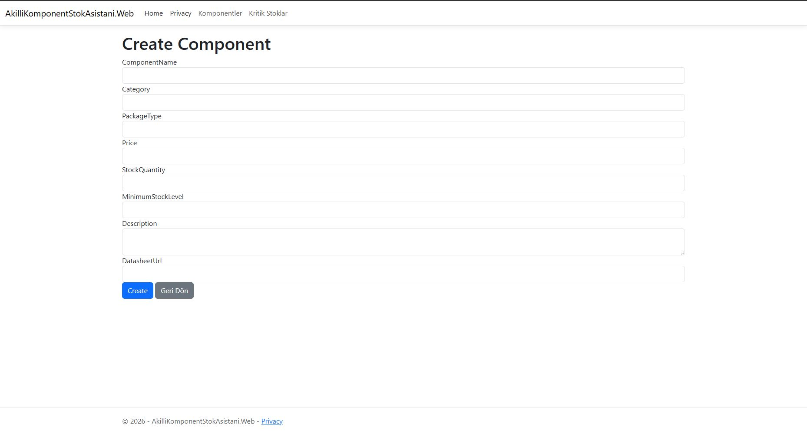
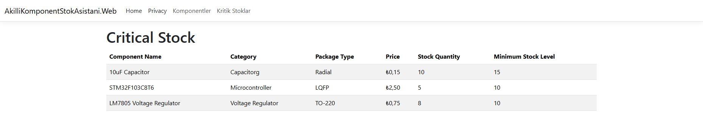

# Akıllı Komponent Stok Asistanı

Akıllı Komponent Stok Asistanı, elektronik komponentlerin stok takibini yapmak, kritik stok seviyelerini görüntülemek ve stok durumunu dashboard üzerinden analiz etmek amacıyla geliştirilen bir ASP.NET Core MVC web uygulamasıdır.

Bu proje, Yapay Zeka Destekli Yazılım Geliştirme dersi kapsamında; veritabanı kullanımı, clean code yaklaşımı, katmanlı mimari, yapay zeka destekli geliştirme süreci ve teknik dokümantasyon kriterlerine uygun olarak hazırlanmıştır.

---

## İçindekiler

- [Proje Amacı](#proje-amacı)
- [Temel Özellikler](#temel-özellikler)
- [Kullanılan Teknolojiler](#kullanılan-teknolojiler)
- [Proje Görselleri](#proje-görselleri)
- [Proje Mimarisi](#proje-mimarisi)
- [Klasör Yapısı](#klasör-yapısı)
- [Veritabanı Tasarımı](#veritabanı-tasarımı)
- [Kritik Stok Mantığı](#kritik-stok-mantığı)
- [Seed Data](#seed-data)
- [Dashboard](#dashboard)
- [Uygulama Sayfaları](#uygulama-sayfaları)
- [Kurulum](#kurulum)
- [Testler](#testler)
- [Yapay Zeka Destekli Geliştirme Süreci](#yapay-zeka-destekli-geliştirme-süreci)
- [Kullanılan Prompt Yaklaşımı](#kullanılan-prompt-yaklaşımı)
- [Clean Code Yaklaşımı](#clean-code-yaklaşımı)
- [Git ve Commit Süreci](#git-ve-commit-süreci)
- [Lisans](#lisans)
- [Geliştirici](#geliştirici)

---

## Proje Amacı

Elektronik komponentlerle çalışan kullanıcıların stok durumunu daha düzenli şekilde takip edebilmesini sağlamak hedeflenmiştir.

Uygulama sayesinde kullanıcılar:

- Elektronik komponentleri sisteme ekleyebilir.
- Kayıtlı komponentleri listeleyebilir.
- Komponent detaylarını görüntüleyebilir.
- Komponent bilgilerini güncelleyebilir.
- Komponent kayıtlarını silebilir.
- Kritik stok seviyesine düşen ürünleri ayrı sayfada görüntüleyebilir.
- Dashboard üzerinden stok durumunu özet olarak inceleyebilir.

---

## Temel Özellikler

- Komponent listeleme
- Yeni komponent ekleme
- Komponent detaylarını görüntüleme
- Komponent düzenleme
- Komponent silme
- Kritik stoktaki komponentleri listeleme
- Dashboard ekranı
- Toplam komponent sayısı gösterimi
- Kritik stok sayısı gösterimi
- Toplam stok adedi gösterimi
- Ortalama fiyat gösterimi
- En düşük stoklu ürünlerin gösterimi
- Kategori bazlı ürün dağılımı
- SQLite veritabanı kullanımı
- Entity Framework Core ile veri erişimi
- Repository ve Service katmanları
- Bootstrap 5 destekli kullanıcı arayüzü
- Yapay zeka destekli geliştirme sürecinin dokümante edilmesi

---

## Kullanılan Teknolojiler

- ASP.NET Core MVC
- C#
- .NET 9
- Entity Framework Core
- SQLite
- Razor View Engine
- Bootstrap 5
- xUnit
- Git / GitHub
- Visual Studio Code
- AI Agent / Yapay Zeka Destekli Kod Üretimi

---

## Proje Görselleri

Bu bölümde uygulamanın temel ekran görüntüleri yer almaktadır.

> Not: Görsellerin README üzerinde görünmesi için ilgili ekran görüntülerini repoda `docs/images/` klasörü içine ekleyiniz.

### Dashboard Ekranı

Dashboard ekranı, toplam komponent sayısı, kritik stok sayısı, toplam stok adedi, ortalama fiyat, kritik stoktaki ürünler, en düşük stoklu ürünler ve kategori dağılımı gibi özet bilgileri gösterir.



---

### Komponent Listeleme Ekranı

Komponent listeleme ekranında sistemde kayıtlı elektronik komponentler tablo halinde görüntülenir. Kullanıcı bu ekran üzerinden detay, düzenleme ve silme işlemlerine erişebilir.



---

### Yeni Komponent Ekleme Ekranı

Yeni komponent ekleme ekranı üzerinden komponent adı, kategori, paket tipi, fiyat, stok miktarı, minimum stok seviyesi, açıklama ve datasheet bağlantısı gibi bilgiler girilebilir.



---

### Kritik Stok Ekranı

Kritik stok ekranı, minimum stok seviyesine ulaşmış veya bu seviyenin altına düşmüş komponentleri ayrı olarak listeler.



---

## Proje Mimarisi

Projede katmanlı ve sade bir mimari yaklaşım kullanılmıştır.

Genel yapı şu şekildedir:

```text
Controller
   ↓
Service
   ↓
Repository
   ↓
AppDbContext
   ↓
SQLite Database
```

### Controller Katmanı

Controller katmanı, kullanıcıdan gelen HTTP isteklerini karşılar ve uygun view dosyalarını döndürür.

Projede `ComponentsController`, komponentlerle ilgili listeleme, ekleme, düzenleme, silme, detay görüntüleme ve kritik stok işlemlerinden sorumludur.

Controller katmanında doğrudan veritabanı erişimi yapılmamıştır.

### Service Katmanı

Service katmanı, iş kurallarının uygulandığı katmandır.

Bu katmanda uygulanan bazı kurallar:

- Komponent adı boş olamaz.
- Kategori boş olamaz.
- Fiyat negatif olamaz.
- Stok miktarı negatif olamaz.
- Minimum stok seviyesi negatif olamaz.
- Paket tipi boşsa varsayılan değer atanabilir.
- Güncelleme işleminde `UpdatedAt` alanı güncellenir.

### Repository Katmanı

Repository katmanı, veritabanı işlemlerinden sorumludur.

Bu katmanda Entity Framework Core kullanılarak komponentler üzerinde CRUD işlemleri yapılır.

### Data Katmanı

`AppDbContext` sınıfı, Entity Framework Core yapılandırmasını ve seed data işlemlerini içerir.

---

## Klasör Yapısı

```text
Akilli-Komponent-Stok-Asistani
│
├── AkilliKomponentStokAsistani.Web
│   ├── Controllers
│   │   ├── HomeController.cs
│   │   └── ComponentsController.cs
│   │
│   ├── Data
│   │   └── AppDbContext.cs
│   │
│   ├── Models
│   │   └── ComponentItem.cs
│   │
│   ├── ViewModels
│   │   └── DashboardViewModel.cs
│   │
│   ├── Repositories
│   │   ├── IComponentRepository.cs
│   │   └── ComponentRepository.cs
│   │
│   ├── Services
│   │   ├── IComponentService.cs
│   │   └── ComponentService.cs
│   │
│   ├── Views
│   │   ├── Components
│   │   │   ├── Index.cshtml
│   │   │   ├── Details.cshtml
│   │   │   ├── Create.cshtml
│   │   │   ├── Edit.cshtml
│   │   │   ├── Delete.cshtml
│   │   │   └── CriticalStock.cshtml
│   │   │
│   │   ├── Home
│   │   │   └── Index.cshtml
│   │   │
│   │   └── Shared
│   │       └── _Layout.cshtml
│   │
│   ├── Migrations
│   ├── Program.cs
│   └── appsettings.json
│
├── AkilliKomponentStokAsistani.Tests
│
├── docs
│   └── images
│       ├── dashboard.png
│       ├── components-list.png
│       ├── component-create.png
│       └── critical-stock.png
│
├── .gitignore
├── LICENSE
├── README.md
└── AkilliKomponentStokAsistani.sln
```

---

## Veritabanı Tasarımı

Projede SQLite veritabanı kullanılmaktadır. Veritabanı işlemleri Entity Framework Core ile yönetilmektedir.

Ana tablo, `ComponentItem` entity sınıfı üzerinden oluşturulmuştur.

### ComponentItem Alanları

| Alan | Açıklama |
|---|---|
| `Id` | Komponentin benzersiz kimliği |
| `ComponentName` | Komponent adı |
| `Category` | Komponent kategorisi |
| `PackageType` | Komponent paket tipi |
| `Price` | Komponent fiyatı |
| `StockQuantity` | Mevcut stok miktarı |
| `MinimumStockLevel` | Minimum stok seviyesi |
| `Description` | Komponent açıklaması |
| `DatasheetUrl` | Komponent datasheet bağlantısı |
| `CreatedAt` | Kayıt oluşturulma tarihi |
| `UpdatedAt` | Kayıt güncellenme tarihi |
| `IsCriticalStock` | Kritik stok durumunu hesaplayan property |

---

## Kritik Stok Mantığı

Bir komponentin kritik stokta sayılması için aşağıdaki koşul kullanılmıştır:

```text
StockQuantity <= MinimumStockLevel
```

Bu koşul sağlanıyorsa ilgili komponent kritik stokta kabul edilir ve arayüzde farklı şekilde gösterilir.

---

## Seed Data

Uygulama ilk kurulumda örnek komponent verileri ile başlatılmaktadır.

Örnek komponentler:

- 1k Ohm Resistor
- 10uF Capacitor
- STM32F103C8T6
- BC547 Transistor
- LM7805 Voltage Regulator

Bu veriler, uygulamanın demo sırasında hızlıca test edilebilmesini sağlar.

---

## Dashboard

Ana sayfada uygulamanın genel stok durumunu gösteren bir dashboard bulunmaktadır.

Dashboard üzerinde şu bilgiler yer almaktadır:

- Toplam komponent sayısı
- Kritik stoktaki ürün sayısı
- Toplam stok adedi
- Ortalama komponent fiyatı
- Kritik stoktaki ürünler
- En düşük stoklu ürünler
- Kategori bazlı ürün dağılımı

Dashboard, kullanıcıya stok durumunu hızlıca değerlendirme imkânı sağlar.

---

## Uygulama Sayfaları

### Ana Sayfa / Dashboard

```text
/
```

Stok durumunun genel özetini gösterir.

### Komponent Listesi

```text
/Components
```

Sistemde kayıtlı tüm komponentleri listeler.

### Yeni Komponent Ekleme

```text
/Components/Create
```

Yeni komponent kaydı oluşturmak için kullanılır.

### Komponent Detayı

```text
/Components/Details/{id}
```

Seçilen komponentin detaylarını gösterir.

### Komponent Düzenleme

```text
/Components/Edit/{id}
```

Seçilen komponentin bilgilerini güncellemek için kullanılır.

### Komponent Silme

```text
/Components/Delete/{id}
```

Seçilen komponenti silmeden önce onay ekranı gösterir.

### Kritik Stoklar

```text
/Components/CriticalStock
```

Yalnızca kritik stok seviyesine ulaşmış veya bu seviyenin altına düşmüş komponentleri listeler.

---

## Kurulum

Projeyi kendi bilgisayarınızda çalıştırmak için aşağıdaki adımları izleyebilirsiniz.

### 1. Repoyu klonlayın

```bash
git clone https://github.com/birolefesezen/Akilli-Komponent-Stok-Asistani.git
```

### 2. Proje klasörüne girin

```bash
cd Akilli-Komponent-Stok-Asistani
```

### 3. Paketleri geri yükleyin

```bash
dotnet restore
```

### 4. Projeyi derleyin

```bash
dotnet build
```

### 5. Veritabanını oluşturun

```bash
dotnet ef database update --project AkilliKomponentStokAsistani.Web
```

### 6. Uygulamayı çalıştırın

```bash
dotnet run --project AkilliKomponentStokAsistani.Web
```

Uygulama varsayılan olarak aşağıdaki adreste çalışabilir:

```text
http://localhost:5185
```

---

## Testler

Projede xUnit test projesi bulunmaktadır.

Test projesi:

```text
AkilliKomponentStokAsistani.Tests
```

Testleri çalıştırmak için:

```bash
dotnet test
```

---

## Yapay Zeka Destekli Geliştirme Süreci

Bu projede uygulama içerisine doğrudan çalışan bir yapay zeka servisi eklenmemiştir. Ancak proje geliştirme sürecinde yapay zeka destekli araçlardan yararlanılmıştır.

Yapay zeka araçları şu amaçlarla kullanılmıştır:

- Proje fikrinin netleştirilmesi
- Mimari yapının planlanması
- Entity modelinin oluşturulması
- Entity Framework Core ve SQLite yapılandırmasının planlanması
- Repository ve Service katmanlarının oluşturulması
- CRUD ekranlarının oluşturulması
- Dashboard ekranının geliştirilmesi
- README ve proje dokümantasyonunun hazırlanması
- Hataların analiz edilmesi ve çözüm yollarının belirlenmesi

Yapay zeka araçlarından alınan çıktılar doğrudan kontrolsüz şekilde kullanılmamıştır. Her aşamadan sonra proje aşağıdaki komutlarla kontrol edilmiştir:

```bash
dotnet build
```

Ayrıca önemli geliştirme adımları ayrı Git commitleri ile GitHub reposuna gönderilmiştir.

---

## Kullanılan Prompt Yaklaşımı

Projede yapay zeka araçları tek seferde tüm projeyi oluşturmak için değil, kontrollü ve aşamalı geliştirme için kullanılmıştır.

İzlenen yaklaşım:

- Önce proje amacı açıklandı.
- Kullanılacak teknoloji yığını belirtildi.
- Her geliştirme adımı küçük görevlere ayrıldı.
- AI Agent’a yalnızca belirli dosyalarda işlem yapması söylendi.
- Yanlış proje klasörlerine dokunmaması özellikle belirtildi.
- Oluşturulan kodlar build edilerek kontrol edildi.
- Hatalı çıktılar manuel olarak analiz edildi.
- Başarılı aşamalar GitHub’a commit olarak gönderildi.

Örnek geliştirme aşamaları:

```text
1. Proje iskeleti oluşturma
2. Entity ve DbContext oluşturma
3. SQLite yapılandırması
4. Repository ve Service katmanı oluşturma
5. CRUD ekranlarını oluşturma
6. Dashboard ekranı geliştirme
7. README dosyasını hazırlama
```

---

## Clean Code Yaklaşımı

Projede clean code ilkelerine uygunluk için aşağıdaki yaklaşımlar tercih edilmiştir:

- Controller içinde doğrudan veritabanı erişimi yapılmamıştır.
- İş kuralları Service katmanında toplanmıştır.
- Veri erişimi Repository katmanına ayrılmıştır.
- Dependency Injection kullanılmıştır.
- Async metotlar tercih edilmiştir.
- Model validasyonları kullanılmıştır.
- Kod dosyaları sorumluluklarına göre klasörlere ayrılmıştır.
- Gereksiz build çıktıları GitHub reposundan çıkarılmıştır.
- `.gitignore` dosyası ile `bin`, `obj`, `.db` gibi dosyalar takip dışı bırakılmıştır.

---

## Git ve Commit Süreci

Proje geliştirilirken her önemli aşama ayrı commit olarak GitHub’a gönderilmiştir.

Örnek commit aşamaları:

```text
Initial ASP.NET Core MVC project setup
Add component model and SQLite database context
Remove generated build artifacts from repository
Add repository and service layers
Add component CRUD pages
Add dashboard overview page
Fix dashboard table layout
Update project README
```

Bu yaklaşım sayesinde geliştirme süreci takip edilebilir hale getirilmiştir.

---

## Lisans

Bu proje MIT lisansı ile lisanslanmıştır. Detaylar için `LICENSE` dosyasına bakınız.

---

## Geliştirici

**BIROL EFE SEZEN**

GitHub: https://github.com/birolefesezen